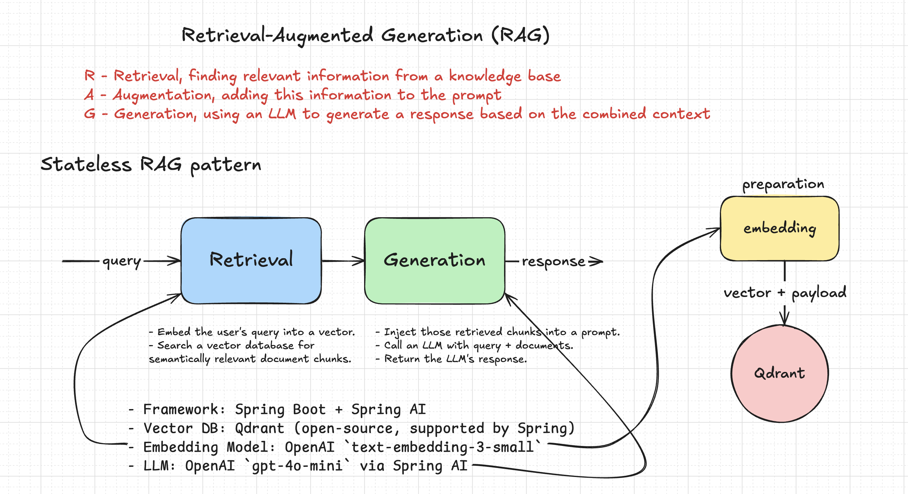

# Spring Boot RAG Demo

A stateless Retrieval-Augmented Generation (RAG) application built using Spring Boot and Spring AI.

## Overview

This application demonstrates a modern RAG pattern implemented with Spring Boot and OpenAI's embedding and chat models. It provides a simple REST API that allows users to ask questions about specific documents stored in a vector database.

### What is RAG?

RAG (Retrieval-Augmented Generation) is a pattern that combines:

1. **Retrieval**: Finding relevant information from a knowledge base
2. **Augmentation**: Adding this information to the prompt
3. **Generation**: Using an LLM to generate a response based on the combined context

This approach improves accuracy and factual grounding of AI responses by providing specific context from trusted sources.

### Stateless Design

This implementation uses a stateless approach where:

- Each query is processed independently
- No conversation history is maintained
- Each request follows a complete RAG flow: embed → search → prompt → generate

## Architecture



The application implements a stateless RAG pattern as illustrated in the diagram above:

### Workflow

1. User sends a question to the REST API
2. **Retrieval Phase**:
   - Embed the user's query into a vector
   - Search a vector database for semantically relevant document chunks
3. **Generation Phase**:
   - Inject retrieved chunks into a prompt
   - Call an LLM with query + documents
   - Return the LLM's response

### Technology Stack

- **Framework**: Spring Boot + Spring AI
- **Vector DB**: Qdrant (open-source, supported by Spring)
- **Embedding Model**: OpenAI `text-embedding-3-small`
- **LLM**: OpenAI `gpt-4o-mini` via Spring AI
- **Docker**: For containerizing the application and dependencies
- **Swagger/OpenAPI**: API documentation

## Package Structure

The application follows a hexagonal/clean architecture with domain-centric package organization:

### Core Domain
- **`domain`**: Contains the core domain models and orchestration services
  - Rich domain models shared across the application
  - RagService for coordinating the full RAG workflow
  - DataInitializer for populating the vector store

### Adapters
- **`embedding`**: Handles text-to-vector transformations using OpenAI
  - Includes embedding-specific models and services
- **`chat`**: Manages interactions with OpenAI's language models
  - Includes chat-specific models and services
- **`vectorstore`**: Manages vector storage and retrieval in Qdrant
  - Includes vector store-specific models and services
- **`web`**: Exposes the REST API endpoints and contains web-layer DTOs
  - Groups all web-related concerns in one place

### Architectural Benefits

This domain-centric approach provides several advantages:

- **Clean Dependencies**: Adapter packages depend on the domain, not on each other
- **Separation of Concerns**: Each package has a clear, focused responsibility
- **Testability**: Easier to mock dependencies for testing
- **Flexibility**: Implementation details in adapters can change without affecting the domain

## Getting Started

### Prerequisites

- Java 21
- Maven
- Docker (for running Qdrant)
- OpenAI API key

### Setup

1. Clone this repository
2. Configure your OpenAI API key in `application.yml`
3. Start Qdrant using Docker:
   ```bash
   docker-compose up -d
   ```
4. Build and run the application:
   ```bash
   ./mvnw spring-boot:run
   ```

## API Usage

Send a question to the RAG endpoint:

```bash
curl -X POST http://localhost:8080/api/ask \
  -H "Content-Type: application/json" \
  -d '{"question": "What is RAG?"}'
```

## License

This project is open source under the MIT license.
